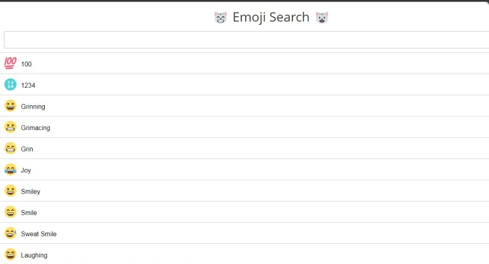

1 - Create Emoji data in local json file and display the emojis with the name 

2 - create one Search bar to search the Emoji by the name 

3 - whenever you search the Emoji it need to filter and display Emojis which are related to the name in search 

4 - If the searched Emoji is not in the data need to display "No Emoji Found"

5 - Make your Own UI to display the Emoji

"# Emoji-Search-Application" 
